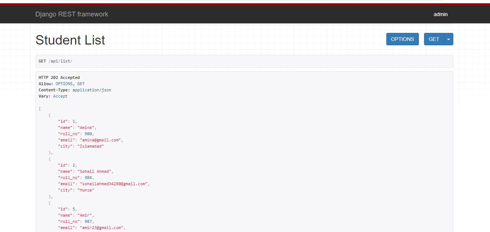

# Student Management API

Student Management API is a RESTful API designed to manage student-related operations in an educational system. The API provides functionality to efficiently handle key aspects of student data management. It supports CRUD (Create, Read, Update, Delete) operations to ensure that student information, are easy to access, update, and maintain.

This API allows users to manage student records by performing the following actions:


## Key Features

- **Create** new student profiles, including personal.

- **Retrieve** and view student information by unique identifiers (e.g., ID).

- **Update** student data such as name,  city, and email.

- **Delete** student profiles when no longer needed


## API Endpoints

#### Get all items

```http
  GET /api/list (http://127.0.0.1:8000/api/list/)
```

| Parameter            | Type  | Description                | Method |
| :------------------- | :---- | :------------------------- | :----- |
| `No parameter` | `Null` | **List**. Retrieve all students data | `GET` |


#### Get item

```http
  GET /api/items/<id>/ (http://127.0.0.1:8000/api/list/2/)
```

| Parameter            | Type  | Description                | Method |
| :------------------- | :---- | :------------------------- | :----- |
| `id` | `int` | **Required**. Id of item to fetch | `GET` |

#### Create items 

```http
  POST /api/create (http://127.0.0.1:8000/api/create/)
```

| Parameter            | Type  | Description                | Method |
| :------------------- | :---- | :------------------------- | :----- |
| `No parameter` | `Null` | **Create**. new student records | `POST` |


#### Complete Update item

```http
  PUT /api/update/<id>/ (http://127.0.0.1:8000/api/update/1/)
```

| Parameter            | Type  | Description                | Method |
| :------------------- | :---- | :------------------------- | :----- |
| `id` | `int` | **Required**. Id of item for complete update | `PUT` |

#### Partial Update item

```http
  PATCH /api/update/<id>/ (http://127.0.0.1:8000/api/update/1/)
```

| Parameter            | Type  | Description                | Method |
| :------------------- | :---- | :------------------------- | :----- |
| `id` | `int` | **Required**. Id of item for partial update | `PATCH` |

#### Delete item

```http
  DELETE /api/destroy/<id>/ (http://127.0.0.1:8000/api/destroy/1/)
```

| Parameter            | Type  | Description                | Method |
| :------------------- | :---- | :------------------------- | :----- |
| `id` | `int` | **Required**. Id of item to delete | `DELETE` |


##  Endpoint Details

#### **1. Create a New Student Record**

- Method: POST
- Endpoint: api/create/

This action allows users to create a new student record by submitting a student's details (such as name, roll number, email, and city) via a POST request. The data is sent in JSON format, and the API will validate the input before saving the student record in the database.

#### **Request Format**
When sending a POST request, you need to provide the following data in JSON format:

```bash
{
  "name": "Sohail Ahmad",
  "roll_no": 103,
  "email": "sohailahmed34280@gmail.com",
  "city": "Karachi"
}
```

#### **Response**
If the request is valid and the data passes validation, the API will create a new student record and return the newly created record along with a 201 Created status code.

#### **2. Read (Retrieve) Student Records**

- Method: GET
- Endpoint: api/list/ (Retrieve all students)
- Endpoint: api/list/<id>/ (Retrieve a single student by ID)

This action allows users to read student records from the system.

#### **Request Format**
- GET api/list/: No data needs to be sent, just make the GET request.
- GET api/list/2/: This retrieves the student with the ID 2.


#### **Response**
The API responds with a JSON array (for all students) or a JSON object (for a specific student), along with a 202 Accepted status code.

```bash
{
  "roll_no": 2
  "name": "Sidra",
  "roll_no": 612,
  "email": "sidraqurban77@gmail.com",
  "city": "Karachi"
}
```

#### **3. Update an Existing Student Record**

- Method: PUT (Full update) or PATCH (Partial update)
- Endpoint: api/update/<id>/
This action allows users to update the details of an existing student:

- **PUT:** Updates all fields of the student record.
- **PATCH:** Updates only the specific fields that are provided in the request.

#### **Request Format**
- PUT api/update/1/ (Full update):

```bash
{
  "name": "Sajjad Ali",
  "roll_no": 1044,
  "email": "sajjadali@gmail.com",
  "city": "Lahore"
}
```
- PATCH api/update/4/ (Partial update):

```bash
{
  "name": "Ali Khan"
}
```


#### **Response**
If the update is successful, the API will return the updated student record along with a 200 OK status code

#### **4. Delete a Student Record**

- Method: DELETE
- Endpoint: api/destroy/<id>/

This action allows users to delete a student record by specifying the student's ID. Once deleted, the record is permanently removed from the database.

#### **Request Format**
- DELETE api/destroy/4/: Deletes the student with ID 4.


#### **Response**
If the deletion is successful, the API will return a 204 No Content status code, indicating that the resource has been deleted successfully.


## DRF browserable API overview




## Installation

1. **Clone the repository:**
    ```bash
    https://github.com/Sohail342/DRF-CRUD-API.git
    ```

2. **Create a virtual environment:** (optional but recommended)
    ```bash
    python3 -m venv env
    source env/bin/activate  # On Windows use `env\Scripts\activate`
    ```

3. **Install dependencies:**
    ```bash
    pip install -r requirements.txt
    ```
    **Be sure in project directory to install requirements.txt**

4. **Make migrations:**
    ```bash
    python manage.py makemigrations
    ```

5. **Run migrations:**
    ```bash
    python manage.py migrate
    ```

6. **Create a superuser:**
    ```bash
    python manage.py createsuperuser
    ```

7. **Run the development server:**
    ```bash
    python manage.py runserver
    ```

8. **Access the browserable API:**
    Open your browser and go to `http://127.0.0.1:8000/api/list`


## Tech Stack

**Server:** Django, Python

**RESTful API:** Dajango RESTful Framework (DRF)


## Contact

If you have any questions or feedback, feel free to reach out:

<p align="left">
<a href="https://wa.me/+923428041928" target="blank"></a>
<a href="https://www.hackerrank.com/sohail_ahmad342" target="blank"></a>
<a href="https://www.linkedin.com/in/sohailahmad3428041928/" target="blank"></a>
<a href="https://instagram.com/sohail_ahmed113" target="blank"></a>
<a href="mailto:sohailahmed34280@gmail.com" target="blank"></a>
</p>
